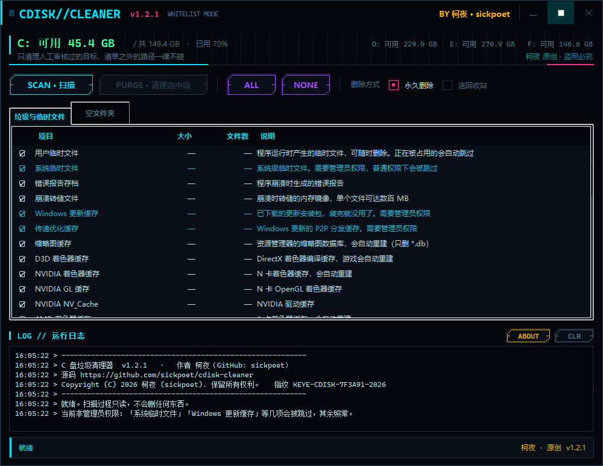

# C 盘垃圾清理器

Windows 上一键清理 C 盘垃圾、临时文件和空文件夹的小工具。

**它不扫描整个磁盘找"垃圾"**——那种做法迟早会出事。它内置一份经过人工审核的清理清单，
只清清单里的东西，清单之外的一律不碰。




> 图为示例数据。实际运行时这一栏的数字取决于你机器上的情况。

## 特点

- **白名单制**：只有内置清单里的目标会被处理。删之前还会过两道闸门——先确认路径确实
  属于某个已审核的目标，再确认它不在绝对保护区内。两道都过才动手。
- **先扫后清**：点「扫描」只读地算出每项占多少、有多少文件，你勾选后点「清理选中项」
  才真正删除。删之前还会再弹一次清单让你确认。
- **默认永久删除**：真正释放磁盘空间。也提供「送回收站」模式（但注意：送回收站不会
  立刻释放空间，要再清空回收站才算数）。
- **不做多余的事**：不常驻后台、不写注册表、不开机自启、不连网。
- **零第三方依赖**：只用 Python 标准库。
- **无边框界面**：标题栏也是自绘的，从标题栏到状态条统一配色。

## 绝对不碰的东西

工具内部有一份硬编码的保护名单，落在其中的路径**即使被写进清理清单也会被拒绝**：

| 类别 | 具体 |
|---|---|
| 系统核心 | `C:\Windows`（除 `Temp` 与软件分发缓存）|
| 程序目录 | `Program Files`、`Program Files (x86)`、`ProgramData` |
| 用户资料 | 桌面、文档、图片、视频、音乐、下载、OneDrive |
| 程序配置 | `AppData\Roaming`、`AppData\LocalLow`、`AppData\Local\Packages` |
| 系统机制 | `$Recycle.Bin`、`System Volume Information`、`Recovery`、`Boot`、`EFI` |
| 关键子目录 | `System32`、`SysWOW64`、`WinSxS`、`assembly`、`Fonts`、`Installer` 等 |

另外还有两条兜底：不允许删除任何盘符根目录，不允许删除当前程序自身的运行目录
（打包成单文件时程序解压在 `%TEMP%` 里，清理临时文件时不能把自己删了）。

## 能清什么

| 分类 | 项目 |
|---|---|
| 临时文件 | 用户临时文件、系统临时文件、错误报告、崩溃转储 |
| 系统缓存 | Windows 更新缓存、传递优化缓存、缩略图缓存 |
| 显卡缓存 | D3D / NVIDIA / AMD 着色器缓存 |
| 浏览器 | Chrome、Edge、Firefox 网页缓存（**不碰**书签、密码、Cookie、登录状态）|
| 开发工具 | pip、npm、pnpm、Yarn、uv、NuGet、Go 模块、Cargo、Gradle、通用 `.cache` |
| 应用残留 | 各类客户端下载完却没装的更新包 |
| 空文件夹 | 单独一栏列出，**默认不勾选** |
| 回收站 | 清空回收站（不可撤销，默认不勾选）|

## 用法

### 直接下载 exe（推荐）

到 [Releases](../../releases) 下载 `cdisk-cleaner.exe`，双击运行。不需要装 Python。

### 从源码运行

```bash
python cdisk_cleaner.py
```

或者双击 `run.bat`，它会自动在 PATH 里挑一个带 tkinter 的 Python。

> 注意：如果你的机器上 `python` 指向的是没装 tcl/tk 的解释器，
> 直接跑会弹出「缺少 tkinter」的提示框。用 `run.bat` 可以避开这个坑。

### 想要清得更彻底

「系统临时文件」「Windows 更新缓存」「旧版 Windows 文件」这几项需要管理员权限。
**右键 exe → 以管理员身份运行**，这几项才能生效。普通权限下它们会被自动跳过，
其余项目照常工作。

## 空文件夹这一项，说实话

清空文件夹**几乎省不了空间**——一个空目录在 NTFS 上只占一个目录项，几 KB 而已。
扫出一万个也就几十 MB。

而且 Windows 上的"空文件夹"很多是必需的：`C:\Windows\assembly` 下的、回收站内部的、
`System32` 里的，删了直接出系统故障。

所以本工具的做法是：

- 默认**不勾选**
- 扫描时**跳过所有系统目录与保护区**
- 点「ALL」全选时，盘符根下的**顶层**空目录也会跳过——`D:\WeGameApps`、
  `D:\Netease\...` 这类多半是程序自己建的占位目录，运行时才往里写东西，
  删了可能让程序报错。真要清理得单独勾
- 清理前还会再过一遍路径守卫，盘符根、系统关键目录一个都不放过

如果你看到这一栏里没几个项目，那是正常的，也是对的。

## 自检

仓库带了一份回归自检（76 项），覆盖路径守卫的拦截与放行、扫描/清理的端到端流程、
界面组件的接口，以及无边框窗口的任务栏样式、边缘缩放与最小化恢复：

```bash
python selftest.py
```

其中「必须拦住」那一组是安全底线——`System32`、`Program Files`、用户文档、
盘符根目录等都必须被拒绝。改动守卫相关代码后请先跑这个。

## 打包成 exe

仓库里带了打包脚本，版本号、图标、版本资源都只有一个来源：

```bash
pip install pyinstaller pillow
python build_exe.py
```

可选参数：

| 参数 | 作用 |
|---|---|
| `--onedir` | 打成目录版。启动约 1 秒、退出秒关；单文件版每次要先解压再清理临时目录，慢一些 |
| `--upx` | 启用 UPX 压缩。**默认关闭**——只省一点体积，但加壳会拉高国内杀软的误报率 |
| `--upx-dir` | 指定 UPX 目录（必须在命令行传，写进 spec 里无效）|
| `--keep-console` | 保留控制台窗口，排查启动问题时用 |

## 实现要点

- **界面**：tkinter。配色是自绘出来的——ttk 先切到 `clam` 主题（Windows 原生主题
  不接受颜色覆盖），再逐项染色；按钮和单选按钮用 Canvas 画切角描边，
  所以看起来不太像原生控件。
- **无边框窗口**：`overrideredirect(True)` 去掉系统标题栏，整条标题栏（最小化 /
  最大化 / 关闭 / 拖动 / 边缘缩放）都是自绘的。这个调用会顺手丢掉三样东西，都补了回来：
  - **任务栏图标** → 窗口会变成 `WS_POPUP` + `WS_EX_TOOLWINDOW`，从任务栏和 Alt+Tab
    一起消失。用 `SetWindowLongW` 把扩展样式换成 `WS_EX_APPWINDOW`
  - **最小化** → 无边框窗口调 `iconify()` 会直接报
    `override-redirect flag is set`。先临时恢复边框再最小化，之后轮询 `state()`
    等它回来，再把边框去掉（不监听 `<Map>`：`deiconify()` 实测不触发它，
    而 `overrideredirect(False)` 反而会触发一次，混在一起没法区分）
  - **边缘缩放** → 自己判定边缘热区（6px）并改 geometry，按最小尺寸夹住

  万一 `overrideredirect` 没设上，会退回原生边框 + 深色标题栏
  （`DwmSetWindowAttribute` attr 20；HWND 必须用 `GetParent(winfo_id())` 取，
  直接拿 `winfo_id()` 调用一律返回 `E_HANDLE`）。
- **回收站大小**：直接遍历 `$Recycle.Bin`，**不用** `SHQueryRecycleBin`。
  本机回收站有 16 万项时那个 API 要跑 50 秒（它会逐个解析 `$I` 元数据），
  改成遍历只要 6 秒。这项统计在单独线程跑，不拖住其他不到 1 秒的项目。
- **送回收站**：`SHFileOperationW` + `FOF_ALLOWUNDO`，一次调用处理整批。
- **删除只读文件**：先用 `os.chmod` 去掉只读位再删。
- **被占用的文件**：跳过并计数，不会中断整个流程。
- **路径比较**：`os.path.normcase` + `normpath` 规范化后再比对，
  避免 `C:\ab` 被误判为 `C:\a` 的子路径。

## 环境要求

- Windows 7 及以上（在 Windows 10 22H2 上实测）
- Python 3.8+（仅从源码运行时需要，且要带 tkinter）

## 作者与出处

- **作者**：柯夜（GitHub: [sickpoet](https://github.com/sickpoet)）
- **仓库**：https://github.com/sickpoet/cdisk-cleaner
- **指纹**：`KEYE-CDISK-7F3A91-2026`

作者与出处出现在下面这些地方，跑一遍或截个图就能看到：

| 位置 | 内容 |
|---|---|
| 标题栏右侧 | `BY 柯夜 · sickpoet` |
| 窗口标题（任务栏 / Alt+Tab） | `C 盘垃圾清理器  v1.2.2   ·   by 柯夜` |
| 顶部仪表盘右下角 | `柯夜 原创 · 盗用必究` |
| 状态条右侧（可点击） | `柯夜 · 原创 v1.2.2` → 打开「关于」对话框 |
| 运行日志开头 | 横幅：作者、仓库、版权、指纹 |
| 「关于」按钮 | 完整信息，含指纹 |
| exe 文件属性 | 公司、版权、备注里都写着出处 |
| 命令行 `--version` | 纯文本输出，便于脚本核对 |

源码里还嵌了一段**不可见的零宽字符水印**（藏在模块文档字符串中），
整段复制源码时会跟着走，用于追溯来源。

**转发、二次分发都欢迎**，但按 MIT 许可的要求，必须保留版权声明与作者署名。
把界面和源码里的署名抹掉、改名冒充原创再发布，是违反许可条款的。

## License

MIT（见 [LICENSE](LICENSE)），版权归柯夜所有。
